# Superpowers Project Plugin

Superpowers Project is a local Codex plugin and skill family that extends Superpowers with GitHub-backed project management:

- durable project context under `docs/superpowers`;
- roadmap and milestone pages;
- native question UI for grilling assumptions;
- GitHub issue mirrors and milestone linkage;
- native `/goal` issue resolution with Superpowers execution skills.

This repository is the canonical source. The live Codex install is a deployment target.

## Public Identity

The public project identity is `codex-superpowers-project`. The plugin runtime identity is `project`, so the prompt surface is plugin-scoped as `project:*`.

This checkout may still be hosted under the older `milestones-plugin` repository name until the GitHub repo is renamed. New public documentation, installation paths, and plugin metadata should use Superpowers Project naming.

## Current Skills

- `$project:initiate-workflow`: routes extension workflows.
- `$project:setup-project`: creates and maintains project setup, context, milestone pages, tracker config, and approved GitHub Project board evidence.
- `$project:brainstorm-spec`: runs Superpowers brainstorming with native grilling.
- `$project:write-plan`: writes Superpowers implementation plans with project context.
- `$project:implement-plan`: implements an approved plan on a development branch without creating GitHub issue mirrors.
- `$project:create-issues`: creates GitHub issue mirrors and GitHub issues from approved plans/specs.
- `$project:resolve-issue`: resolves one issue directly in the current thread with native `/goal` and Superpowers execution.
- `$project:orchestrate-issues`: creates and manages worker-thread issue resolution with aligned thread title, branch name, worktree identity, and PR-ready handoff evidence.
- `$project:merge-changes`: reviews and merges PR-ready issue work, verifies linked issue closure, cleans owned branches and worktrees, prunes, and records clean repo proof.
- `$project:audit-project`: audits project, GitHub, migration, and live-sync drift.

## Native Q&A Workflow

The main workflow is a chain of small native Codex questions. Each skill summarizes what it produced, asks `Continue?`, and then starts the selected next skill automatically. Top-level closeouts always ask `Continue?` with `Yes`, `Revisit`, and `No / Stop / Done`. After `Yes`, nested route menus list only forward routes. After `Revisit`, nested route menus list only review, revision, repair, recovery, rerun, or evidence-gathering routes. `Stop / Done` is not repeated inside those nested route menus.



GitHub can also render the simplified Mermaid companion: [Native Q&A main flow Mermaid](docs/assets/native-qa-main-flow-mermaid.md).

Only `No / Stop / Done` or the explicit final `Healthy?` -> `Done` route ends the continuation loop. `Yes` choices enter the next workflow depth and either start the next skill or ask the next route question. Revisit choices such as `Review First`, revise, repair, or gather evidence must show the relevant artifacts or evidence, ask follow-up questions, and return to the originating continuation gate.

The recommended option should be `Yes` when a safe forward route exists, `Revisit` when evidence or repair is needed, and `No / Stop / Done` only when the workflow is terminal, blocked, or the user has asked to stop.

| Native question | Where it appears | Top-level choices | Nested examples |
| --- | --- | --- | --- |
| `project_setup_next_step` | After Setup Project | Yes, Revisit, No / Stop / Done | Brainstorm Spec, Write Plan, Create Issues, Run Doctor |
| `project_brainstorm_next_step` | After Brainstorm Spec | Yes, Revisit, No / Stop / Done | Create One Plan, Multi-Spec Planning, Revise Spec |
| `project_plan_next_step` | After Write Plan | Yes, Revisit, No / Stop / Done | Create Issues, Implement Plan, Resolve Issue, Orchestrate Issues |
| `project_implement_next_step` | After Implement Plan | Yes, Revisit, No / Stop / Done | Merge Changes, Review Evidence, Revise Branch |
| `project_issue_next_step` | After Create Issues | Yes, Revisit, No / Stop / Done | Resolve Issues, Orchestrate Issues, Repair Issue Mirrors |
| `project_issue_resolution_route` | Before issue implementation when route is ambiguous | Resolve, Orchestrate, Review First | Direct current-thread work or worker-thread worktree |
| `project_resolve_next_step` | After direct issue work is PR-ready | Yes, Revisit, No / Stop / Done | Merge, Resolve Another, Address CI / Checks |
| `project_orchestrate_next_step` | After worker-thread issue work is PR-ready | Yes, Revisit, No / Stop / Done | Merge, Recover Worker |
| `project_merge_approval` | Before merge | Merge, Decline | Premerge evidence review |
| `project_merge_next_step` | After merge closeout | Yes, Revisit, No / Stop / Done | Doctor, Resolve Another, Re-run Cleanup |
| `project_doctor_next_step` | After a Doctor audit | Yes, Revisit, No / Stop / Done | Apply Repair, Create Planning Spec, Run Audit Again |

## Implement Plan

`$project:implement-plan` is the direct execution path after `$project:write-plan` when an approved plan without a GitHub issue should be implemented without GitHub issue mirrors.

Implement Plan uses a development branch, native `/goal` where applicable, Superpowers execution discipline, focused verification, and `$project:merge-changes` for final integration. It does not create issue mirrors and must not claim GitHub issue closure. Use the issue-backed `$project:create-issues` route first for non-trivial work that should have GitHub issue and milestone backbone.

## Canonical Layout

```text
.codex-plugin/plugin.json
skills/<skill-name>/
scripts/install.ps1
scripts/sync-live.ps1
scripts/validate.ps1
docs/superpowers/PROJECT_CONTEXT.md
docs/superpowers/specs/
docs/superpowers/plans/
docs/superpowers/issues/
docs/superpowers/milestones/
```

`skills/` contains the full skill implementations and is the only skill source root.

The retired Milestones artifact model is migration history only. New Superpowers Project artifacts should not be written under the old Milestones issue or idea folders, root-level issue folders, root-level plan folders, or milestone-local plan folders.

## Validate

```powershell
pwsh.exe -NoProfile -ExecutionPolicy Bypass -File .\scripts\validate.ps1
```

## CI And Releases

GitHub Actions runs the same validation command used locally:

```powershell
pwsh.exe -NoProfile -ExecutionPolicy Bypass -File .\scripts\validate.ps1
```

Release gates and tag rules are documented in `docs/superpowers/RELEASE_POLICY.md`. The first release after this migration is `v0.2.0`.

## Sync To Live Codex Install

```powershell
pwsh.exe -NoProfile -ExecutionPolicy Bypass -File .\scripts\sync-live.ps1 -Validate
```

The sync script deploys this repo's plugin manifest and full skill implementations to:

- `C:\Users\Tanner\plugins\project`

It also deploys only the shared helper skill to:

- `C:\Users\Tanner\.agents\skills\advanced-user-input`

## Install

From a local clone:

```powershell
git clone https://github.com/tannerpolley/codex-superpowers-project.git
cd codex-superpowers-project
pwsh.exe -NoProfile -ExecutionPolicy Bypass -File .\scripts\install.ps1
```

If you are installing from the current pre-rename repository checkout, run the same install command from that checkout root.

```powershell
pwsh.exe -NoProfile -ExecutionPolicy Bypass -File .\scripts\install.ps1
```

After install, start with `$project:initiate-workflow` in Codex to route setup, brainstorming, planning, issue creation, issue resolution, orchestration, merge cleanup, or Doctor audits.
