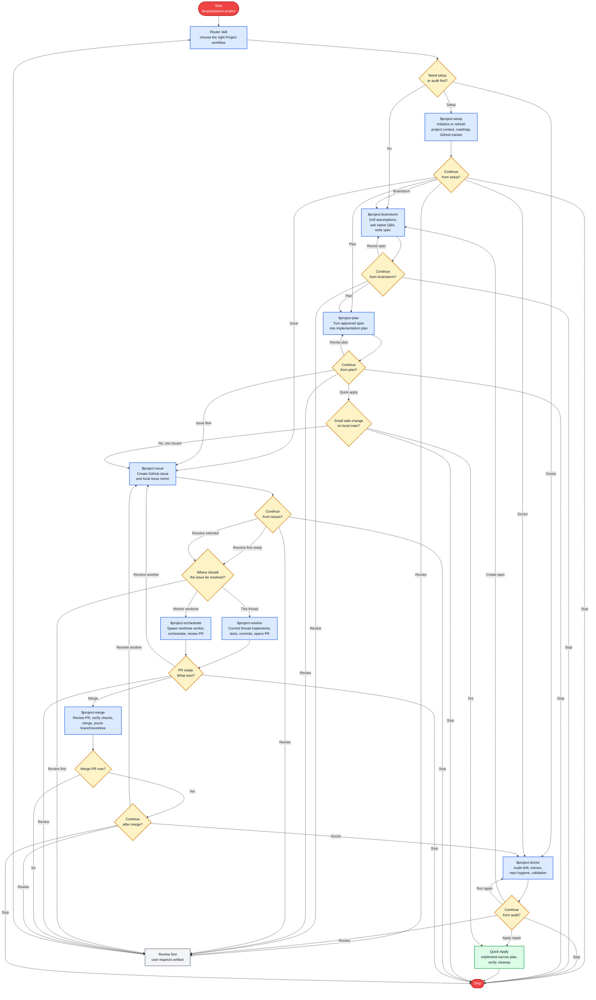

# Superpowers Project Plugin

Superpowers Project is a local Codex plugin and skill family that extends Superpowers with GitHub-backed project management:

- durable project context under `docs/superpowers`;
- roadmap and milestone pages;
- native question UI for grilling assumptions;
- GitHub issue mirrors and milestone linkage;
- native `/goal` issue resolution with Superpowers execution skills.

This repository is the canonical source. The live Codex install is a deployment target.

## Public Identity

The public project identity is `codex-superpowers-project`. The plugin runtime identity remains `superpowers-project` so the router skill stays stable.

This checkout may still be hosted under the older `milestones-plugin` repository name until the GitHub repo is renamed. New public documentation, installation paths, and plugin metadata should use Superpowers Project naming.

## Current Skills

- `$superpowers-project`: routes extension workflows.
- `$project-setup`: creates and maintains project setup, context, milestone pages, tracker config, and approved GitHub Project board evidence.
- `$project-brainstorm`: runs Superpowers brainstorming with native grilling.
- `$project-plan`: writes Superpowers implementation plans with project context.
- `$project-issue`: creates GitHub issue mirrors and GitHub issues from approved plans/specs.
- `$project-resolve`: resolves one issue directly in the current thread with native `/goal` and Superpowers execution.
- `$project-orchestrate`: creates and manages worker-thread issue resolution with aligned thread title, branch name, worktree identity, and PR-ready handoff evidence.
- `$project-merge`: reviews and merges PR-ready issue work, verifies linked issue closure, cleans owned branches and worktrees, prunes, and records clean repo proof.
- `$project-doctor`: audits project, GitHub, migration, and live-sync drift.

## Native Q&A Workflow

The main workflow is a chain of small native Codex questions. Each skill summarizes what it produced, asks one clear "what next?" question, and then starts the selected next skill automatically.



| Native question | Where it appears | Main choices |
| --- | --- | --- |
| `project_setup_next_step` | After `$project-setup` | Project Brainstorm, Project Plan, Project Issue, Project Doctor, Review First, Stop |
| `project_brainstorm_next_step` | After `$project-brainstorm` | Project Plan, Review First, Revise Spec, Stop |
| `project_plan_next_step` | After `$project-plan` | Project Issue First, Quick Apply, Review First, Revise Plan, Stop |
| `project_quick_apply_approval` | Before a small local-main change | Apply on Main, Use Issue Flow, Stop |
| `project_issue_next_step` | After `$project-issue` | Resolve First Ready, Resolve Selected, Review First, Stop |
| `project_issue_resolution_route` | Before issue implementation when route is ambiguous | Project Resolve, Project Orchestrate, Review First |
| `project_resolve_next_step` | After direct issue work is PR-ready | Project Merge, Resolve Another, Review First, Stop |
| `project_orchestrate_next_step` | After worker-thread issue work is PR-ready | Project Merge, Recover Worker, Review First, Stop |
| `project_merge_approval` | Before merge | Merge, Decline |
| `project_merge_next_step` | After merge closeout | Project Doctor, Resolve Another, Review First, Stop |
| `project_doctor_next_step` | After a Doctor audit | Apply Repair, Create Planning Spec, Run Audit Again, Review First, Stop |

## Quick Apply

Quick Apply is the small-work escape hatch after `$project-plan`: it can apply a narrow, low-risk plan directly on local clean synced `main` only after the native `project_quick_apply_approval` question selects `Apply on Main`.

Use the bundled `skills/project-plan/scripts/validate-quick-apply.ps1` gate to require approval, focused verification commands, cleanup hook evidence, and explicit push approval before any push. The issue-backed `$project-issue` and `$project-resolve` execution path remains the default for non-trivial work, risky changes, multi-issue scope, branch-backed work, and PR-bound implementation.

## Canonical Layout

```text
.codex-plugin/plugin.json
skills/<skill-name>/
scripts/install.ps1
scripts/sync-live.ps1
scripts/validate.ps1
docs/superpowers/PROJECT_CONTEXT.md
docs/superpowers/specs/
docs/superpowers/plans/
docs/superpowers/issues/
docs/superpowers/milestones/
```

`skills/` contains the full skill implementations and is the only skill source root.

The retired Milestones artifact model is migration history only. New Superpowers Project artifacts should not be written under the old Milestones issue or idea folders, root-level issue folders, root-level plan folders, or milestone-local plan folders.

## Validate

```powershell
pwsh.exe -NoProfile -ExecutionPolicy Bypass -File .\scripts\validate.ps1
```

## CI And Releases

GitHub Actions runs the same validation command used locally:

```powershell
pwsh.exe -NoProfile -ExecutionPolicy Bypass -File .\scripts\validate.ps1
```

Release gates and tag rules are documented in `docs/superpowers/RELEASE_POLICY.md`. The first release after this migration is `v0.2.0`.

## Sync To Live Codex Install

```powershell
pwsh.exe -NoProfile -ExecutionPolicy Bypass -File .\scripts\sync-live.ps1 -Validate
```

The sync script deploys this repo's plugin manifest and full skill implementations to:

- `C:\Users\Tanner\plugins\superpowers-project`

It also deploys the same skill implementations to:

- `C:\Users\Tanner\.agents\skills`

## Install

From a local clone:

```powershell
git clone https://github.com/tannerpolley/codex-superpowers-project.git
cd codex-superpowers-project
pwsh.exe -NoProfile -ExecutionPolicy Bypass -File .\scripts\install.ps1
```

If you are installing from the current pre-rename repository checkout, run the same install command from that checkout root.

```powershell
pwsh.exe -NoProfile -ExecutionPolicy Bypass -File .\scripts\install.ps1
```

After install, start with `$superpowers-project` in Codex to route setup, brainstorming, planning, issue creation, issue resolution, orchestration, merge cleanup, or Doctor audits.
