# Native Q&A Main Flow Mermaid

This is the simplified Mermaid companion to `native-qa-main-flow.svg`. It shows only the top-level native Q&A gates. Nested route menus stay inside their owning skill boxes unless the route chooses between actual workflow skills.

```mermaid
%%{init: {"flowchart": {"curve": "linear"}, "theme": "base", "themeVariables": {"background": "#ffffff", "primaryTextColor": "#111827", "lineColor": "#111827", "fontFamily": "Arial"}}}%%
flowchart TB
    start(["Start"])
    rule["First-level gate rule<br/>Continue? = Yes / Revisit / No<br/>Yes moves forward. Revisit loops back to the same skill. No stops."]
    initiate["Initiate Workflow<br/>Nested routes: setup, spec, plan, issue, implementation, merge, Doctor"]
    d_initiate{"Continue?<br/>from router<br/>Yes / Revisit / No"}

    setup["Setup Project<br/>Nested routes: roadmap, milestones, tracker, GitHub Project board, Doctor"]
    d_setup{"Continue?<br/>from setup<br/>Yes / Revisit / No"}

    brainstorm["Brainstorm Spec<br/>Nested routes: create one plan, multi-spec planning, revise spec"]
    d_brainstorm{"Continue?<br/>from brainstorm<br/>Yes / Revisit / No"}

    plan["Write Plan<br/>Nested revisit routes: review, grill, rescope"]
    d_plan{"Continue?<br/>from plan<br/>Yes / Revisit / No"}
    d_work_route{"Choose work route?<br/>select the next blue skill"}

    implement["Implement Plan<br/>Non-issue branch with /goal, tests, verification, and merge proof"]
    create_issues["Create Issues<br/>Publish GitHub issues and sync local issue mirrors"]

    d_implement{"Continue?<br/>from implementation<br/>Yes / Revisit / No"}

    d_create{"Continue?<br/>from issues<br/>Yes / Revisit / No"}
    d_issue_route{"Choose issue route?<br/>select the next blue skill"}

    orchestrate["Orchestrate Issues<br/>Worker worktree route with aligned thread, branch, and PR handoff"]
    resolve["Resolve Issue<br/>Current thread uses /goal, TDD, verification, branch, and PR"]

    d_ready{"Continue?<br/>from resolved work<br/>Yes / Revisit / No"}

    merge["Merge Changes<br/>Approval, checks, merge, issue close, branch/worktree cleanup"]
    d_merge{"Continue?<br/>from merge<br/>Yes / Revisit / No"}

    audit["Audit Project<br/>Optional Doctor check for drift, sync, trackers, and artifacts"]
    d_audit{"Healthy?<br/>Yes = Done<br/>Revisit = repair<br/>No = stop"}
    done(["Done"])

    subgraph work_choices[" "]
        direction LR
        implement ~~~ d_work_route ~~~ create_issues
    end

    subgraph issue_choices[" "]
        direction LR
        orchestrate ~~~ d_issue_route ~~~ resolve
    end

    start --> rule --> initiate --> d_initiate
    d_initiate -->|Yes| setup

    setup --> d_setup
    d_setup -->|Yes| brainstorm

    brainstorm --> d_brainstorm
    d_brainstorm -->|Yes| plan

    plan --> d_plan
    d_plan -->|Yes| d_work_route
    d_work_route -->|Implement Plan| implement
    d_work_route -->|Create Issues| create_issues

    implement --> d_implement
    d_implement -->|Yes| merge

    create_issues --> d_create
    d_create -->|Yes| d_issue_route
    d_issue_route -->|Orchestrate| orchestrate
    d_issue_route -->|Resolve| resolve

    orchestrate --> d_ready
    resolve --> d_ready
    d_ready -->|Yes| merge

    merge --> d_merge
    d_merge -->|Yes| audit

    audit --> d_audit
    d_audit -->|Yes| done

    classDef start fill:#0f172a,stroke:#020617,color:#ffffff,stroke-width:2px
    classDef skill fill:#dbeafe,stroke:#2563eb,color:#111827,stroke-width:2px
    classDef decision fill:#fef3c7,stroke:#d97706,color:#111827,stroke-width:2px
    classDef revisit fill:#f3f4f6,stroke:#6b7280,color:#111827,stroke-width:2px
    classDef stop fill:#fee2e2,stroke:#dc2626,color:#991b1b,stroke-width:2px
    classDef done fill:#dcfce7,stroke:#16a34a,color:#166534,stroke-width:2px

    class start start
    class initiate,setup,brainstorm,plan,implement,create_issues,orchestrate,resolve,merge,audit skill
    class d_initiate,d_setup,d_brainstorm,d_plan,d_work_route,d_implement,d_create,d_issue_route,d_ready,d_merge,d_audit decision
    class rule revisit
    class done done

    style work_choices fill:transparent,stroke:transparent
    style issue_choices fill:transparent,stroke:transparent
```

