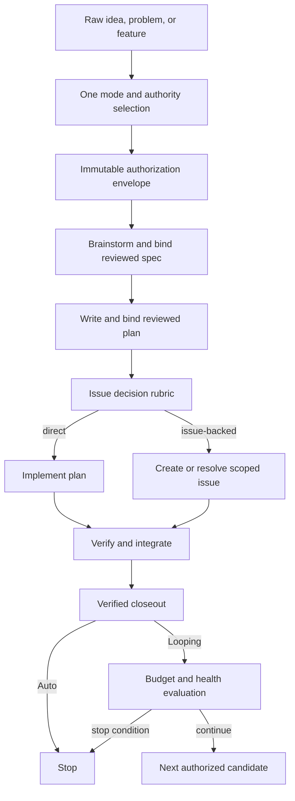

# Auto And Loop Lifecycle Semantics Design

## Status

Proposed. This specification defines workflow behavior but does not implement it.

## Context

Auto Mode currently has several competing meanings. Initiation asks for Auto before a spec exists, the authorization validator requires an existing source spec, historical design asks about Auto again after specification, and downstream skills render their own continuation, topology, publication, push, PR, and merge questions.

The result does not match the product promise. A user can select Auto and still be asked for bounded merge or another route decision. Looping Mode inherits the same ambiguity and adds an incomplete candidate-continuation policy.

The canonical product contract is one startup selection for one outcome lifecycle. Auto then moves a new idea, problem, or feature through understanding, specification, planning, route selection, execution, verification, integration, and closeout. It asks no routine questions. Looping repeats that lifecycle for bounded candidates.

## Source Findings

This design resolves these findings from `docs/superpowers/specs/2026-07-10-autonomous-workflow-and-codex-worktree-audit-findings.md`:

- production Auto and Looping startup provenance is rejected;
- fresh-request Auto requires a source spec that does not exist;
- downstream skills are not mode-aware;
- one route is confused with one skill invocation;
- Auto cannot decide between issue-backed and direct execution;
- Looping raw-request and continuation semantics are incomplete.

It supersedes the removed June 4, June 15, June 16, and July 9 workflow-governance designs and their matching plans.

## Canonical Mode Contract

| Mode | Startup authority | Routine questions | Work unit | Normal stop |
|---|---|---|---|---|
| Manual | Current user direction | Ask at material gates | One user-directed outcome lifecycle | Verified closeout or explicit user stop |
| Auto | One explicit Auto selection | None | One requested outcome lifecycle | Verified closeout or fail-closed blocker |
| Looping | One explicit Looping selection plus bounded budget | None inside a candidate | Repeated Auto-like candidate lifecycles | Budget, no-ready, final-health, or configured between-candidate stop |

A lifecycle crosses owner skills. Brainstorming, planning, issue creation, implementation, resolution, merge, and closeout are steps, not separate authorizations.

## Goals

1. Make the startup mode selection the sole routine authorization question for Auto and Looping.
2. Allow a raw request to receive valid authority before a spec or plan exists.
3. Carry mode, authority, candidate identity, and lifecycle state across every owner-skill boundary.
4. Resolve downstream gates through one mode-aware interface.
5. Let Auto decide whether the work needs a real GitHub issue using a recorded rubric.
6. Preserve mandatory verification and mutation safety without asking bounded-merge or equivalent questions.
7. Give Looping a finite candidate state machine and explicit continuation policy.

## Non-Goals

- Making Auto an unlimited permission grant.
- Allowing destructive Git operations or unrelated-repository changes.
- Draining an entire project backlog from a single feature request.
- Weakening fail-closed evidence gates.
- Selecting the physical worktree provider.
- Redesigning workflow graph storage or plugin packaging.
- Removing Manual Mode questions.

## Authorization Envelope

The startup selection creates an immutable root authorization:

```yaml
schema_version: 1
authorization_id: <stable id>
repository_identity: <canonical repository id>
request_fingerprint: <hash of normalized user request>
candidate_root_id: <stable id>
mode: manual | auto | looping
authorized_by: request_user_input | explicit_user_message
authorized_at: <RFC 3339 timestamp>
interaction_policy: ask-at-material-gates | no-routine-prompts
mutation_envelope:
  repository_files: true
  development_branches: true
  codex_worktree_tasks: true
  github_issue_when_required: true
  push_pr_merge_after_proof: true
  unrelated_repositories: false
  destructive_git: false
  broad_queue_drain: false
stop_policy: <mode-specific object>
authorization_hash: <sha256>
```

The source request, not a future spec, anchors this envelope. Generated artifacts attach later through append-only events.

## Alternatives

### Alternative A: Patch each skill prompt

Teach each skill to skip its own questions when a mode variable says Auto.

This can remove visible prompts but leaves each skill responsible for interpreting authority. Drift and silent permission expansion would remain likely.

### Alternative B: Shared lifecycle controller and gate resolver

Create one lifecycle state machine and one gate resolution interface. Owner skills keep domain ownership but read and append shared workflow events.

This is the selected design. It provides one semantic source without replacing the existing skill workflow.

### Alternative C: Separate autonomous workflow engine

Route Auto and Looping through a new engine while Manual uses the current skills.

This creates two products and two test surfaces. It is not warranted before the shared contract is proven.

## Selected Design

### Lifecycle Controller

The controller owns candidate state, authority, artifact binding, and permitted transitions. It does not brainstorm, write plans, implement code, or merge changes. Those actions remain with owner skills.

The first-phase states are:

```text
requested
authorized
specifying
spec_reviewed
planning
plan_reviewed
route_decided
executing_direct | executing_issue
verifying
integrating
closing_out
completed | blocked | stopped
```

Each transition appends an event with run ID, candidate ID, prior-event hash, owner skill, inputs, outputs, decision rationale, and evidence references. Invalid transitions fail before the next owner skill runs.

### Artifact Binding

The authorization remains immutable. When the spec and plan are created, the controller appends:

- `spec_bound` with repository-relative path and content hash;
- `spec_reviewed` with review receipt;
- `plan_bound` with repository-relative path and content hash;
- `plan_reviewed` with review receipt.

This removes the impossible requirement that a raw request already have a source spec. Editing a bound artifact produces a new version event and invalidates state derived from its old hash.

### Gate Resolver

Every owner skill calls the same interface:

```text
resolve_gate(gate_id, options, recommendation, evidence, lifecycle_context)
```

The resolver returns a decision event, not just an option string.

In Manual Mode, it renders the native question defined by the workflow graph and records the user's answer.

In Auto or Looping Mode, it:

1. confirms that the gate is authorized for noninteractive resolution;
2. filters options against the mutation envelope and current evidence;
3. selects the safest option that advances the requested outcome;
4. records the selected option, rejected options, evidence, and rationale;
5. returns without rendering a question.

If no option stays within authority and safety policy, it records a structured blocker and stops. It does not fall back to asking a routine question.

### Gates Consumed By Startup Authority

Auto and Looping consume startup authority at these current workflow gates:

- brainstorming continuation and design approval;
- post-spec continuation;
- post-plan route selection;
- implementation topology;
- issue publication when the issue rubric requires it;
- push and PR creation;
- bounded-merge or merge disposition;
- post-resolution audit and closeout;
- branch and task-worktree cleanup disposition.

The controller must retain each decision as an event. Skipping a visible question does not mean skipping a decision.

### Issue Decision Rubric

After the plan is reviewed, the controller evaluates whether to execute directly or create a real issue.

A real issue is required when any of these conditions holds:

- the requested outcome spans independent deliverables that need separate ownership;
- the work needs asynchronous review or handoff outside the current lifecycle;
- external tracking, release notes, or stakeholder visibility is part of the request;
- implementation cannot proceed in the current session and a durable queue item is needed;
- repository policy explicitly requires issue-backed work for the change class.

Direct implementation is preferred when all of these conditions hold:

- one plan can be executed as a coherent change;
- the current lifecycle can retain ownership through verification;
- no external tracker requirement applies;
- issue creation would only duplicate the plan.

The decision event records every rubric result. Issue creation is scoped to this lifecycle, not the surrounding backlog.

### Auto Merge Semantics

Selecting Auto authorizes push, PR creation, and merge for the current outcome only after the execution-kernel specification's required proof passes. Bounded merge is an internal limit, not a second user question.

The merge resolver selects among allowed strategies from repository policy. It blocks when checks fail, authorization is stale, the PR head changes, the base is unsafe, or the action leaves the mutation envelope.

### Looping Candidate Semantics

Looping Mode wraps the Auto candidate lifecycle in a finite controller:

```text
initialize_loop
discover_candidates
select_candidate
run_candidate_lifecycle
record_candidate_outcome
evaluate_budget_and_health
continue | complete | blocked | stopped
```

The initial raw request may itself be candidate one. Later candidates must come from the authorized candidate source and remain inside the startup scope.

The first release supports one optional between-candidate checkpoint configured at startup. It never inserts questions inside a candidate lifecycle. If no checkpoint is configured, the loop continues until a stop condition is met.

Required stop conditions are candidate budget reached, elapsed-time budget reached, no ready candidate, project-health failure, repeated same-cause blocker, authorization expiry, or explicit user interruption.

### User Interruption

A new user message may narrow, stop, or replace active authority. The controller appends an interruption event and recomputes valid transitions. It never treats silence or a model-generated statement as renewed authority.

## Data Flow



## Error Handling

The lifecycle fails closed with a stable blocker when:

- startup authority is missing, forged, or bound to another repository;
- an owner skill attempts an invalid transition;
- a bound artifact changed without a new binding event;
- a downstream gate has no authorized option;
- an owner skill attempts native input in a no-routine-prompts lifecycle;
- a mutation would exceed the authorization envelope;
- issue or merge evidence no longer matches provider state;
- Looping exceeds a configured budget or repeats the same blocker threshold.

A blocker receipt states the current lifecycle state, failed rule, observed evidence, permitted recovery paths, and whether new user authority is required.

## Compatibility And Migration

Existing owner skills remain entrypoints. Their local continuation language becomes a call to the shared gate resolver. Manual behavior remains interactive.

Historical ledgers with `source_spec` as a prerequisite may be inspected but cannot start a new raw-request Auto lifecycle. A migration command may bind an existing reviewed spec and plan into a new authorization envelope when the user explicitly resumes old work.

## Testing Strategy

### Startup matrix

Test Manual, Auto, and Looping from both a raw request and an existing reviewed spec. Confirm repository binding, authority provenance, and initial transition.

### Question instrumentation

Instrument native input calls. A full raw-request Auto lifecycle must make one startup mode call and zero downstream question calls. A Looping candidate must make zero intra-candidate calls. Manual fixtures must still render required gates.

### Lifecycle transition tests

Exercise every valid transition and reject skipped, repeated, cross-candidate, stale-artifact, and wrong-owner transitions.

### Route tests

Use rubric fixtures for direct implementation and issue-backed execution. Confirm the real issue count comes from provider observation and that Auto never defaults unconditionally to one route.

### Merge tests

Confirm that Auto consumes a valid merge authorization without rendering bounded merge. Confirm that failed checks and changed heads block without prompting.

### Looping tests

Test raw-request candidate one, multiple candidates, no-ready stop, budget stop, final-health stop, repeated blocker stop, optional between-candidate checkpoint, and user interruption.

### Installed-plugin trials

Run natural-language requests through fresh Manual, Auto, and Looping sessions. Grade observed tool calls, questions, artifacts, external mutations, and final state. Hardcoded zero counters are not acceptable evidence.

## Acceptance Criteria

- A raw request can enter Auto before a spec exists.
- Auto asks exactly one startup mode/authority question and no routine downstream questions.
- No post-spec Auto prompt or bounded-merge prompt appears.
- The spec and plan bind through append-only events without replacing root authority.
- Auto chooses direct or issue-backed execution through the recorded rubric.
- Verification and fail-closed merge proof remain mandatory.
- Looping runs finite candidate lifecycles and stops on explicit policy.
- Manual Mode retains native questions at material gates.
- Every owner skill reads the same lifecycle context and gate result format.
- Fresh installed-plugin trials prove the behavior from observed calls and state.

## Outcome Proof

The implementation must produce three complete traces:

1. a raw-request Auto trace from one startup selection through verified closeout with zero downstream questions;
2. an issue-backed Auto trace showing rubric evidence, real provider mutation, PR proof, and no bounded-merge question;
3. a multi-candidate Looping trace showing candidate isolation, budget evaluation, and terminal stop.

Each trace includes the authorization envelope, hash-chained events, bound artifact hashes, gate decisions, external mutation receipts, validation receipts, and final repository state.

## Risks

- Treating Auto as convenience prompting could hide an overly broad mutation grant.
- A resolver default without evidence could reproduce hardcoded routing under a new name.
- Owner skills may retain old question paths and bypass the resolver.
- Looping can expand scope if candidate discovery is not bound to startup authority.
- User interruption can race with a pending mutation.

Mitigations are one immutable envelope, exhaustive gate inventory, instrumented question tests, event-bound candidates, and mutation-time authority revalidation.

## Unresolved Decisions

- The default candidate-count and elapsed-time budgets for Looping Mode.
- Whether the optional between-candidate checkpoint is exposed in the initial mode question or read from project policy.
- The precise authorization-expiry rule for long-running provider work.

These choices must be explicit before implementation but do not change the one-selection Auto contract.

## Decision Ledger

| Decision | Source | Answer | Impact | Deferred? | Risk owner |
|---|---|---|---|---|---|
| Unit of Auto authority | User's stated Auto expectation | Authorize one requested outcome lifecycle. | Skills become steps inside the outcome, not new permission boundaries. | No | Workflow owner |
| Startup source | Raw-request contradiction reproduced by the audit | Bind authority to the raw request fingerprint. | A new request no longer depends on a future spec. | No | Governance owner |
| Artifact attachment | Immutable-authority requirement | Append artifact-binding events. | Specs and plans extend authority history without rewriting it. | No | State owner |
| Downstream questions | Audit of owner-skill gates | Use one mode-aware resolver. | Every owner skill interprets mode consistently. | No | Workflow owner |
| Auto issue route | User request for agent-chosen issue creation | Apply an evidence-based rubric. | Auto avoids both hardcoded always-create and never-create behavior. | No | Planning owner |
| Bounded merge | User rejection of the second merge question | Consume bounded merge as internal Auto policy. | The safety limit remains without a routine authorization prompt. | No | Merge owner |
| Looping model | Existing incomplete loop contract | Repeat a finite candidate lifecycle. | Budgets, health checks, and terminal states bound the loop. | No | Loop owner |
| Manual behavior | Backward-compatibility requirement | Preserve interactive gates. | Autonomous semantics do not remove user control from Manual Mode. | No | Workflow owner |

## Spec Self-Review

- The user-visible Auto promise is stated as an observable call-count contract.
- Authority, decisions, and proof remain distinct.
- The design preserves owner-skill responsibilities.
- It does not specify validator internals, worktree provider mechanics, or package layout.
- Every normal and blocked stop has an explicit state.
