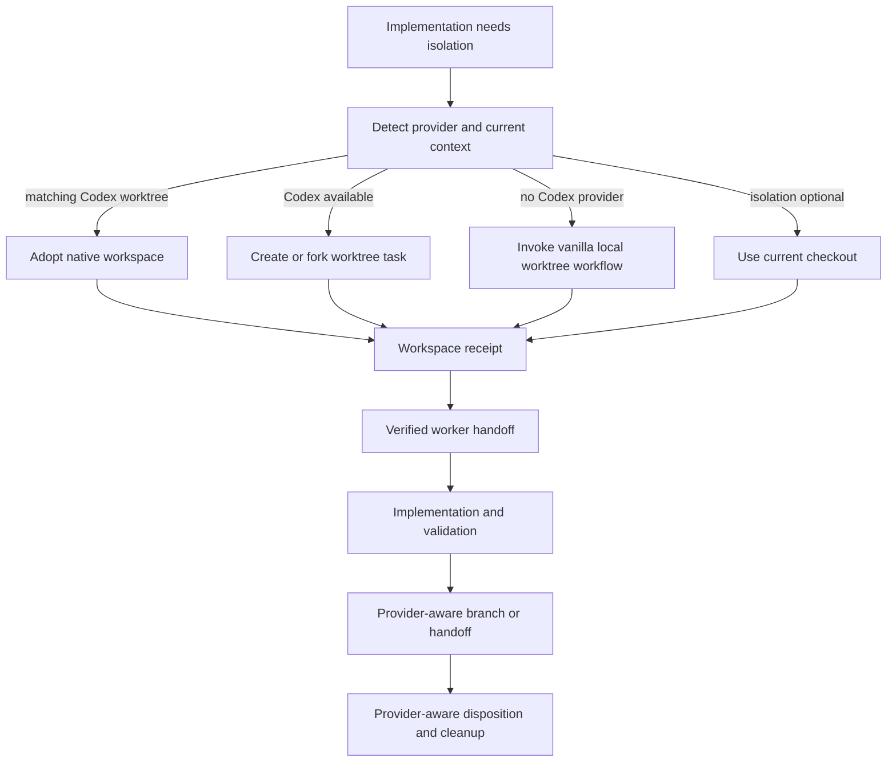

# Codex-Native Workspace Isolation Design

## Status

Proposed. This specification defines provider-aware isolation behavior but does not implement it.

## Context

Vanilla `superpowers:using-git-worktrees` creates and manages Git worktrees, commonly under `.worktrees`. That is appropriate in a terminal-only environment. Codex desktop also has native project tasks backed by app-managed worktrees. Those worktrees are visible in the app, normally start at detached HEAD, and have app-owned lifecycle operations such as Create Branch and Handoff.

The current plugin does not model that distinction. It can describe a current-session collaboration subagent as a worktree worker even though subagents share the same checkout. It also assumes branch creation and cleanup behavior that conflicts with Codex-managed detached worktrees.

Superpowers Project must adapt workspace isolation before delegating implementation technique to vanilla Superpowers. It must not edit, fork, or shadow the vanilla skill.

## Source Findings

This design resolves these findings from `docs/superpowers/specs/2026-07-10-autonomous-workflow-and-codex-worktree-audit-findings.md`:

- subagents are incorrectly modeled as isolated Codex worktree workers;
- native detached worktrees conflict with current branch and cleanup contracts;
- vanilla worktree guidance is not adapted to the Codex app;
- prompt slimming removed load-bearing worktree routing detail.

It supersedes the removed June 3 setup-orchestration design and plan and the worktree portions of the removed July 9 governance documents.

## Provider Model

The plugin recognizes these execution contexts:

| Provider | Isolation | Ownership | Typical Git state | Lifecycle control |
|---|---|---|---|---|
| `current_checkout` | None beyond current checkout | User or current task | Branch or detached | Git and user direction |
| `local_git_worktree` | Separate filesystem checkout | Plugin/user | Named branch | Git worktree commands |
| `codex_managed_worktree` | Separate Codex task checkout | Codex app | Detached HEAD initially | Codex task create, fork, handoff, and app cleanup |
| `shared_subagent` | None | Current task | Same as parent | Collaboration runtime |

A shared subagent is a delegation mechanism, not an isolation provider. The plugin must never claim a separate-workspace receipt for it.

## Goals

1. Prefer Codex-managed worktree tasks when the current environment supports them and isolation is required.
2. Preserve local Git worktrees as the fallback outside the Codex app.
3. Prevent vanilla worktree guidance from creating `.worktrees` when a valid Codex-managed workspace already exists or should be created.
4. Record provider, ownership, task, workspace, repository, and Git state in a verifiable receipt.
5. Handle detached HEAD, branch creation, handoff, merge, and cleanup according to provider ownership.
6. Keep vanilla Superpowers unchanged.

## Non-Goals

- Changing the Codex app's native worktree implementation.
- Treating all implementation work as requiring a worktree.
- Using shared subagents as a substitute for filesystem isolation.
- Manually deleting app-managed worktrees or app metadata.
- Moving unrelated existing worktrees.
- Defining Auto authorization or merge evidence rules.
- Supporting every possible external IDE worktree provider in the first release.

## Alternatives

### Alternative A: Always use vanilla worktrees

Continue creating local worktrees and ignore native Codex tasks.

This is portable, but it duplicates an app feature, hides work from the Codex task interface, and creates conflicting ownership and cleanup expectations.

### Alternative B: Provider-aware isolation adapter

Resolve environment and isolation needs before invoking implementation skills. Use Codex-managed tasks when available and local worktrees otherwise. Pass a workspace receipt downstream.

This is the selected design. It augments vanilla behavior without changing vanilla files.

### Alternative C: Codex-only orchestration

Require Codex desktop and remove local Git worktree support.

This would simplify one environment while breaking CLI and other agent hosts. The plugin remains cross-environment.

## Selected Design

### Isolation Decision

Before implementation or issue resolution, the owner skill calls:

```text
ensure_isolated_workspace(requirement, repository, lifecycle_context)
```

`requirement` is one of:

- `none`: current checkout is explicitly acceptable;
- `preferred`: use isolation when a supported provider is available;
- `required`: fail if no separate filesystem checkout can be proven.

The adapter detects environment capabilities and current task context. It must not infer isolation from a task label, branch name, agent name, or model summary.

### Provider Selection

Selection order is:

1. reuse the current Codex-managed worktree when its repository and candidate bindings match;
2. create or fork a Codex project task with `environment.type = worktree` when Codex native operations are available;
3. create a local Git worktree using vanilla Superpowers guidance when native operations are unavailable;
4. use the current checkout only when the requirement permits it;
5. fail closed when isolation is required and no provider can prove it.

The adapter must discover the Codex project identity before task creation. It must not create a generic thread detached from the current project.

### Vanilla Skill Adapter

Superpowers Project adds a preflight around `superpowers:using-git-worktrees`:

- For `codex_managed_worktree`, record that isolation is already satisfied and do not invoke vanilla creation or cleanup steps.
- For `local_git_worktree`, invoke the vanilla skill and adopt its repository-specific directory and safety rules.
- For `current_checkout`, do not invoke the vanilla skill.
- For `required` with no provider, stop with a blocker.

The plugin never modifies the installed vanilla skill. The adapter exists only in Superpowers Project skills and runtime contracts.

### Workspace Receipt

Provisioning or adoption emits:

```yaml
schema_version: 1
provider: current_checkout | local_git_worktree | codex_managed_worktree
ownership: user | plugin | codex_app
repository_identity: <canonical id>
workflow_run_id: <id>
candidate_id: <id>
task_id: <Codex task id or null>
workspace_id: <provider workspace id>
workspace_path: <canonical absolute path when observable>
git_common_dir: <canonical absolute path>
initial_head: <commit>
head_mode: branch | detached
branch: <name or null>
created_at: <RFC 3339 timestamp>
created_by_operation: adopt | create_task | fork_task | git_worktree_add
cleanup_owner: user | plugin | codex_app
receipt_hash: <sha256>
```

Downstream skills validate repository and candidate binding before using the receipt. The execution kernel rechecks current head and Git common directory at mutation gates.

### Codex-Managed Worktree Flow

When native Codex operations are available:

1. identify the current Codex project and repository;
2. determine whether the current task is already a matching worktree task;
3. create or fork a project task in worktree mode when needed;
4. capture the returned task and workspace identifiers;
5. hand off the implementation context and lifecycle identifiers;
6. let the worker inspect detached or branch state before editing;
7. create a branch through the supported Codex operation when later Git movement requires it;
8. use Handoff when moving work between Local and Worktree is the supported path;
9. leave physical cleanup to the Codex app and record logical disposition.

The originating task may coordinate and validate but must not pretend that a child task's filesystem state is locally present without provider evidence.

### Local Git Worktree Flow

Outside native Codex support:

1. delegate directory selection and Git safety checks to `superpowers:using-git-worktrees`;
2. record the resulting path, branch, head, and Git common directory;
3. verify the path is separate from the coordinating checkout;
4. pass the workspace receipt to the worker;
5. let the finishing workflow remove only the plugin-owned local worktree after integration and verification.

The adapter must respect repository-specific worktree directories and `.gitignore` rules. It must not impose `.worktrees` as a universal location.

### Detached HEAD And Branching

A detached Codex worktree is valid execution state. The plugin must not fail merely because no branch exists at task creation.

Before push or PR creation, the workflow must have one supported integration path:

- create a named branch from the task through Codex;
- hand off the changes to a Local task and create a branch there;
- use another documented provider operation that produces a branch-bound receipt.

Direct ad hoc Git manipulation of app-owned metadata is forbidden.

### Cleanup Ownership

Cleanup follows the receipt:

- `codex_app`: record task disposition and allow the app to manage physical worktree cleanup;
- `plugin`: verify integration, remove only the recorded local worktree, and prune only its own metadata;
- `user`: report the remaining workspace and do not remove it automatically.

No broad `git worktree prune`, directory scan deletion, or `$CODEX_HOME/worktrees` deletion is permitted as candidate cleanup.

### Context Handoff

The worker handoff packet contains the lifecycle run and candidate IDs, source spec and plan hashes, issue identity when present, authorization hash, workspace receipt, required validation commands, and expected return receipt.

It does not copy large prompt prose when stable repo paths and hashes are sufficient. The receiving worker must verify the packet against its checkout before editing.

## Data Flow



## Error Handling

The adapter returns a structured blocker when:

- the Codex project cannot be resolved;
- task creation or fork fails;
- a receipt points to another repository or candidate;
- the claimed worktree path shares the coordinator's checkout;
- a shared subagent is presented as isolated;
- native workspace state cannot be observed;
- local worktree creation violates repository safety rules;
- branch or handoff operations are unsupported for the active provider;
- cleanup ownership is ambiguous.

Fallback from Codex-managed to local worktree is allowed only before a native task is created and only when policy permits a local provider. The adapter must not create both and leave one orphaned.

## Compatibility And Migration

Existing local worktree workflows remain valid when their receipts can prove separate checkout state. Existing issue-worker packets gain the provider and ownership fields.

Historical records that identify a collaboration subagent as a worktree worker remain historical but do not satisfy new isolation gates.

## Testing Strategy

### Provider contract tests

- Adopt a matching current Codex worktree.
- Reject a Codex worktree from another project or candidate.
- Create and fork a native task with provider fixtures.
- Create a local Git worktree when native operations are absent.
- Reject a shared subagent as an isolation provider.

### Git-state tests

- Accept detached HEAD for a new Codex worktree.
- Require a branch-bound receipt before push or PR creation.
- Detect head changes after receipt creation.
- Confirm local and coordinating paths share a Git common directory but not a working tree.

### Ownership tests

- Never delete an app-owned or user-owned worktree.
- Remove only the recorded plugin-owned local worktree.
- Reject cleanup with a mismatched workspace ID.
- Verify no task creates a second `.worktrees` checkout when native isolation is active.

### Handoff tests

Exercise Local to Worktree, Worktree to Local, and worktree task completion. Confirm lifecycle and artifact hashes survive the handoff.

### Installed-app trial

From a fresh Codex desktop task, request isolated implementation. Confirm a visible project worktree task is created, the worker starts from the intended repository commit, no repo-local `.worktrees` directory is created, and final branch movement uses supported Codex operations.

### Non-Codex trial

Run the same isolation request in a terminal host without native task operations. Confirm vanilla local worktree behavior remains functional and the workspace receipt identifies the local provider.

## Acceptance Criteria

- Codex desktop prefers a native project worktree task when isolation is required.
- A shared subagent never receives an isolated-workspace receipt.
- Vanilla Superpowers files remain byte-for-byte unchanged.
- Native isolation suppresses local `.worktrees` creation.
- Detached HEAD is supported until branch movement is required.
- Push and PR steps consume a branch-bound provider receipt.
- App-owned worktrees are not manually deleted by plugin scripts.
- Terminal-only environments retain safe vanilla local worktree support.
- Handoff packets and receipts remain bound to one repository, run, and candidate.
- Installed-app and non-Codex trials prove both provider paths.

## Outcome Proof

Implementation proof consists of:

1. one Codex-managed task trace with task ID, workspace receipt, detached-head observation, branch or handoff receipt, and logical cleanup disposition;
2. one terminal-only local worktree trace with vanilla skill invocation and plugin-owned cleanup;
3. one negative trace proving a shared subagent cannot pass isolation validation;
4. a filesystem check showing no unexpected `.worktrees` directory during the native trial;
5. a diff or checksum check proving the vanilla plugin was not modified.

## Risks

- Codex provider capabilities may differ by app version or environment.
- Native task creation can succeed while later handoff fails.
- Recording absolute paths can leak machine-specific detail into committed artifacts.
- A provider fallback can orphan a partially created task.
- Detached HEAD assumptions can drift as Codex evolves.

Mitigations are capability detection, opaque provider IDs, redacted committed receipts, pre-creation fallback decisions, and provider contract tests.

## Unresolved Decisions

- Whether native task creation should always use create or prefer fork when the coordinator has useful conversation context.
- Which provider fields may be persisted in committed evidence versus ephemeral runtime state.
- Whether a completed app-owned task should be archived automatically after verified integration.

These decisions require current Codex capability confirmation during implementation.

## Decision Ledger

| Decision | Source | Answer | Impact | Deferred? | Risk owner |
|---|---|---|---|---|---|
| Codex isolation | User requirement and current Codex capability review | Prefer native project worktree tasks. | Isolated work is visible, app-managed, and aligned with Codex execution. | No | Workspace owner |
| Vanilla integration | User constraint to preserve vanilla Superpowers | Add a preflight adapter. | The project adapts context without changing vanilla files. | No | Skill owner |
| Subagent classification | Current collaboration runtime behavior | Treat shared subagents as delegation only. | Shared checkout can no longer satisfy filesystem-isolation proof. | No | Orchestration owner |
| Native initial state | Codex worktree behavior | Accept detached HEAD. | Native worktrees can execute before branch movement is required. | No | Git owner |
| Local fallback | Cross-environment plugin requirement | Use the vanilla worktree workflow. | Terminal hosts retain portable, tested behavior. | No | Workspace owner |
| Cleanup | Codex and Git provider ownership | Follow provider ownership. | Plugin scripts cannot delete app-owned or user-owned workspaces. | No | Cleanup owner |
| Proof | Audit of label-based worker packets | Require a provider-bound workspace receipt. | Labels and summaries no longer establish isolation. | No | Validation owner |

## Spec Self-Review

- The design distinguishes delegation from isolation.
- It preserves vanilla Superpowers unchanged.
- Native and local provider paths have observable acceptance tests.
- Branching and cleanup behavior follows provider ownership.
- It does not decide lifecycle authority, evidence-gate internals, or package architecture.
