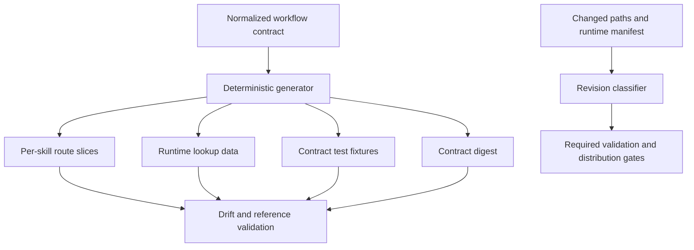

# Contract And Distribution Simplification Design

## Status

Proposed. This specification defines architecture and maintenance behavior but does not implement it.

## Context

The plugin has accumulated several sources for workflow behavior: question definitions, nested routes, gates, skill text, runtime policy, and generated or copied metadata. The July 10 audit found that these representations disagree in places. Prompt complexity moved between files instead of disappearing, while the main CLI grew broad enough to hide shallow safety handlers.

Distribution has similar ambiguity. The plugin depends on vanilla Superpowers but does not verify that dependency as part of setup. Installation also exposes a helper skill through a global user-level namespace. The required post-revision loop treats every canonical document edit as a live plugin refresh even though the runtime package intentionally excludes specs and plans.

The project needs a smaller contract surface, generated projections, explicit dependencies, and a revision policy that matches what is shipped.

## Source Findings

This design resolves these findings from `docs/superpowers/specs/2026-07-10-autonomous-workflow-and-codex-worktree-audit-findings.md`:

- the workflow graph is not fully authoritative;
- installation leaks plugin policy into the global skill namespace;
- the base Superpowers dependency is undeclared and unverified;
- the runtime command module is too broad;
- prompt complexity was relocated rather than eliminated;
- historical design status is ambiguous;
- documentation-only revisions trigger a distribution loop that does not match runtime packaging.

It supersedes the architecture, distribution, and maintenance portions of the removed July 9 specifications and plans.

## Goals

1. Establish one normalized source for workflow modes, gates, options, defaults, transitions, and owner skills.
2. Generate runtime and skill-facing projections instead of hand-copying contract facts.
3. Reduce skill prompt load to the route slice needed by the current owner skill.
4. Split the broad CLI into cohesive modules while preserving stable launchers.
5. Declare and verify the vanilla Superpowers dependency without vendoring or modifying it.
6. Keep helper skills plugin-scoped unless a separate user-level installation is explicitly requested.
7. Classify revisions by shipped impact so validation, sync, install, and release gates match reality.
8. Give specs and plans explicit active, superseded, and historical status rules.

## Non-Goals

- Redefining Auto and Looping lifecycle semantics.
- Implementing safety validator logic.
- Selecting or provisioning worktree providers.
- Replacing Markdown specs and plans with a database.
- Publishing a new marketplace format.
- Removing stable public skill names or shell launchers without a migration period.
- Combining vanilla Superpowers and Superpowers Project into one plugin.

## Alternatives

### Alternative A: Continue patching every representation

Update YAML, skills, scripts, tests, and setup instructions together whenever behavior changes.

This preserves current structure but depends on perfect manual synchronization. The audit shows that this does not scale.

### Alternative B: Normalized contract plus generated projections

Make one machine-readable graph authoritative. Generate route slices, gate metadata, and validation fixtures. Modularize runtime commands and make distribution rules inspect the actual shipped surface.

This is the selected design. It removes duplication while keeping human-readable skills and stable commands.

### Alternative C: Central autonomous engine

Replace skills and workflow files with one executable engine.

This could eliminate some duplication but would make the plugin less composable and move too much product policy into code. It is outside this repair.

## Selected Design

### Normalized Workflow Contract

`docs/superpowers/workflow-contract.yml` remains the canonical policy source, but its schema becomes normalized. Each fact has one owner.

```yaml
schema_version: 2
modes:
  manual:
    interaction_policy: ask-at-material-gates
  auto:
    interaction_policy: no-routine-prompts
  looping:
    interaction_policy: no-routine-prompts
gates:
  <gate_id>:
    owner_skill: <canonical skill name>
    lifecycle_states: [<state>]
    question:
      header: <short label>
      prompt: <single sentence>
    options:
      - id: <stable option id>
        label: <display label>
        effect: <transition or action id>
    manual_default: <option id or null>
    autonomous_policy: <resolver policy id or forbidden>
transitions:
  <transition_id>:
    from: [<states>]
    to: <state>
    owner_skill: <canonical skill name>
```

Question IDs, option IDs, effects, transitions, and owner skills must not be redeclared in nested route trees. A route references gate and transition IDs.

### Generated Projections

A deterministic generator produces:

- one compact route slice per skill;
- runtime lookup tables;
- gate inventory documentation;
- test fixtures for question headers, options, and transitions;
- a contract digest consumed by provenance checks.

Generated files carry a header naming their source and generator version. Validation regenerates them in a temporary location and fails on drift. Generated files are never edited by hand.

### Skill Contract

Each workflow skill contains only:

- its purpose and trigger;
- required inputs;
- its owned domain procedure;
- a reference to its generated route slice;
- explicit stop and handoff behavior;
- scripts or references required for its domain.

Cross-cutting mode, gate, and transition prose is not copied into every skill. Load-bearing provider or safety detail lives in a focused reference linked from the skill, not deleted to meet an arbitrary line target.

Prompt-size validation measures duplicated semantic facts and unresolved references. It does not enforce quality through a raw line-count ceiling.

### Runtime Modules

The public `superpowers-project` command remains stable while internal modules align with bounded responsibilities:

- workflow contract loading and generated projections;
- lifecycle state and event replay;
- gate resolution;
- issue routing and provider integration;
- workspace isolation;
- evidence gates;
- packaging and provenance;
- maintenance and release classification.

Argument parsing and output serialization stay at the command boundary. Domain modules expose typed data rather than printing or exiting directly. A module may not import a higher-level command router.

### Dependency Declaration

The plugin manifest declares vanilla Superpowers as an external required capability with a compatible version range and required canonical skills. Setup and validation perform a read-only preflight:

1. locate the installed vanilla plugin through supported Codex plugin metadata;
2. confirm the compatible version range;
3. confirm required canonical skills are discoverable;
4. report one actionable installation or update command when missing;
5. stop before workflow execution if the dependency is unsatisfied.

The project does not copy vanilla skill files into this repository or modify plugin cache contents.

### Namespace Ownership

Plugin helpers remain under the `superpowers-project:` namespace. Installation must not write `advanced-user-input` or another helper into the global user skill directory as a side effect of installing the plugin.

If a user explicitly wants a standalone personal helper, that is a separate installation product with separate source, version, uninstall path, and consent. Plugin validation confirms that normal install and sync leave unrelated global skills unchanged.

### Revision Classification

Every revision is classified from the changed paths and runtime manifest:

| Class | Examples | Required gates |
|---|---|---|
| `runtime_surface` | manifest, skills, assets, scripts, runtime-included docs | full validation, commit, sync, install refresh, version proof, cleanup |
| `canonical_design` | specs and plans excluded from runtime package | document validation, link/status checks, commit, cleanup |
| `historical_record` | completed receipts or archived evidence excluded from active policy | integrity and link checks, commit, cleanup |
| `repository_support` | tests and contributor tooling not shipped | proportionate tests, commit, cleanup |

If a canonical document is included in the runtime package or referenced by a runtime-read validator, it is classified as `runtime_surface` regardless of directory.

The classifier outputs changed paths, manifest membership, runtime-read references, selected class, and required gates. Repository policy consumes this result instead of using one directory-wide rule.

### Spec And Plan Lifecycle

Canonical artifacts use one of these statuses:

- `Proposed`: design not approved for implementation;
- `Approved`: accepted design awaiting or undergoing implementation;
- `Implemented`: completed contract retained as current architecture;
- `Superseded`: replaced by named artifacts and excluded from active indexes;
- `Historical`: retained only as evidence for a receipt or release.

Active milestone pages list only Proposed, Approved, or current Implemented artifacts. Superseded files are either deleted when Git history is sufficient or retained in an explicit historical index when another shipped artifact requires the path.

Plans that have completed and no longer support a current receipt may be deleted after inbound-reference validation. A receipt-dependent source plan remains historical and is labeled as such.

### Documentation Indexes

Milestone pages become generated or validated indexes. Each listed file must exist, declare a compatible status, and belong to that milestone. The checker rejects dangling paths, duplicate active contracts for the same decision, and a Superseded artifact in an active list.

## Data Flow



## Error Handling

Contract generation fails when:

- an ID is duplicated or missing;
- an option references an unknown effect;
- a route references an unknown gate or transition;
- two owner skills claim the same gate;
- a lifecycle transition is unreachable or invalid;
- a generated projection differs from committed output.

Dependency preflight fails with a distinct missing, incompatible, or incomplete-capability error. It never edits plugin cache paths as recovery.

Revision classification fails when a changed file has ambiguous manifest membership or an unresolved runtime read. Ambiguity selects the stricter gate set until classification is fixed.

Artifact lifecycle validation fails on missing status, dangling supersession links, active indexes that reference Superseded artifacts, and historical deletion that would break a shipped receipt.

## Compatibility And Migration

The normalized contract receives a schema-version migration tool that reads the current contract and reports ambiguous duplicates rather than choosing silently. Existing public gate IDs and option IDs remain stable where semantics have not changed.

Runtime launchers and skill names remain stable. Generated route slices may replace copied skill prose only after behavioral parity tests pass.

The current global helper installation is removed from normal sync after plugin-scoped consumers are migrated. An explicit standalone helper installation, if retained, must not share mutable source with plugin deployment.

The current required post-revision loop remains in force until the classifier and policy update are implemented and validated.

## Testing Strategy

### Contract tests

- Parse and validate the normalized schema.
- Reject duplicate and dangling IDs.
- Compare generated route slices with owner-skill expectations.
- Exercise every gate in Manual and autonomous resolution modes.
- Prove all lifecycle states are reachable through allowed transitions.

### Drift tests

Mutate a gate option, owner skill, transition, and question header in only one generated output. Validation must fail and name the canonical source.

### Prompt-load tests

Measure duplicated contract facts across skills before and after migration. Verify that removing duplication does not remove required provider, authorization, or recovery references.

### Module tests

Import domain modules without initializing the CLI. Confirm they return typed results and do not print, exit, or mutate global state. Public launchers retain their current machine-readable interface.

### Dependency tests

Test compatible vanilla install, missing install, incompatible version, and missing required skill. Confirm setup provides one clear recovery path and leaves cache contents untouched.

### Namespace tests

Snapshot global user skills before plugin install, sync, refresh, and uninstall. Confirm no plugin helper is added, replaced, or removed outside the plugin namespace.

### Revision-classification tests

Test a spec-only edit, a plan-only edit, a skill edit, a script edit, a runtime-included document edit, a test-only edit, and a mixed edit. Confirm each produces the expected gate set. A mixed edit takes the strictest applicable class.

### Artifact-lifecycle tests

Reject dangling milestone links and duplicate active designs. Confirm a stale plan can be deleted when unreferenced and a receipt-bound plan is retained as Historical.

## Acceptance Criteria

- One normalized record owns each gate, option, transition, and owner skill.
- Runtime and skill projections are generated and drift-checked.
- Skills load only their route slice plus focused domain references.
- The broad CLI delegates to cohesive modules without changing stable launchers.
- Setup fails clearly when compatible vanilla Superpowers is unavailable.
- Normal plugin installation does not modify the global user skill namespace.
- A specs-only revision no longer requires live plugin refresh unless runtime membership or runtime reads make it shipped surface.
- Active milestone indexes contain no dangling or Superseded artifact paths.
- Historical receipt dependencies remain intact and labeled.
- Full repository and installed-plugin validation pass.

## Outcome Proof

Implementation proof includes:

1. a contract ownership report showing no duplicate semantic facts;
2. generated-output drift failures from controlled mutations;
3. before-and-after skill context and duplication measurements;
4. module import and launcher compatibility results;
5. dependency preflight results for all supported states;
6. global-skill namespace snapshots across install operations;
7. revision-classifier receipts for every path class;
8. a clean active-artifact index with no dangling links.

## Risks

- Generation can hide complexity if the canonical schema becomes too abstract.
- Stable IDs can preserve obsolete semantics if migration avoids necessary changes.
- Plugin dependency metadata may not support every desired constraint.
- Revision classification can under-classify a document consumed through an untracked runtime read.
- Removing global helpers can break users who relied on accidental installation.
- Deleting stale artifacts can erase context still needed by a receipt.

Mitigations are human-readable generated slices, explicit semantic migrations, runtime-read scanning, stricter mixed classification, namespace migration notices, and inbound-reference checks before deletion.

## Unresolved Decisions

- Whether generated route slices are committed or created during validation and packaging.
- The exact supported vanilla Superpowers version range.
- Whether artifact status belongs in frontmatter or a generated registry.
- How to represent runtime reads that are computed rather than statically discoverable.

These decisions must be made in the implementation plan and validated against the installed Codex plugin system.

## Decision Ledger

| Decision | Source | Answer | Impact | Deferred? | Risk owner |
|---|---|---|---|---|---|
| Workflow authority | Contract-drift findings | Use one normalized contract. | Manual synchronization no longer owns duplicated policy facts. | No | Contract owner |
| Skill consumption | Prompt-complexity audit | Generate route slices. | Skills receive local context without copied global policy. | No | Skill owner |
| Prompt quality | Regression caused by line-count slimming | Validate duplication and references. | Load-bearing detail is not deleted to satisfy a size metric. | No | Validation owner |
| Runtime architecture | Broad CLI audit | Use cohesive modules behind stable launchers. | Internal repair does not break skill integrations. | No | Runtime owner |
| Vanilla relationship | Extension architecture and missing dependency check | Declare an external dependency. | The project verifies vanilla without vendoring or modifying it. | No | Distribution owner |
| Helper namespace | Global-skill leakage finding | Keep helpers plugin-scoped by default. | Installing one plugin cannot silently mutate global user policy. | No | Distribution owner |
| Revision loop | Runtime package versus directory-policy conflict | Classify revisions by shipped impact. | Required gates match the actual distribution surface. | No | Maintenance owner |
| Artifact cleanup | Historical design ambiguity | Use status plus inbound-reference validation. | Active truth stays small without breaking historical receipts. | No | Documentation owner |

## Spec Self-Review

- The design reduces duplicate authority instead of adding another hand-maintained layer.
- Distribution behavior follows observable runtime membership and reads.
- Historical cleanup preserves load-bearing receipts.
- Public skills and launchers keep stable names.
- The design does not redefine Auto behavior, evidence validation, or worktree provisioning.
