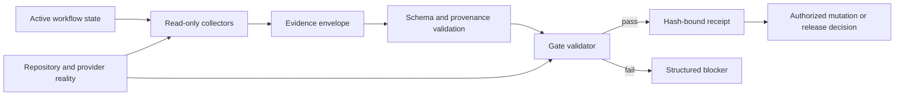

# Execution Kernel And Release Trust Design

## Status

Proposed. This specification defines required behavior but does not implement it.

## Context

The repository advertises evidence-gated execution, verified integration, and release readiness. The July 10 audit found that several mutation-adjacent validators return success without receiving the evidence they claim to validate. A green command receipt can therefore describe an unproven state.

The same audit found a testing gap. Most scenario tests confirm that scripts exist, commands execute, or named fields appear. They do not establish that invalid evidence is rejected or that a valid receipt corresponds to repository reality.

This specification turns the audit's safety findings into one implementation contract. It covers the execution kernel from evidence collection through release publication. Auto and Looping lifecycle behavior, Codex workspace isolation, and contract distribution are owned by companion specifications.

## Source Findings

This design resolves these findings from `docs/superpowers/specs/2026-07-10-autonomous-workflow-and-codex-worktree-audit-findings.md`:

- lifecycle approval and evidence validators fail open;
- scenario and fresh-agent tests overstate behavioral coverage;
- the runtime command module is broad and shallow in safety-critical paths;
- release claims are not consistently derived from trusted receipts.

It supersedes the safety and release portions of the removed July 9 command-runtime, release-readiness, and governance specifications and plans.

## Goals

1. Make every mutation-adjacent gate fail closed when required evidence is absent, malformed, stale, forged, incomplete, or inconsistent with repository state.
2. Separate evidence collection from evidence validation.
3. Bind each decision receipt to one repository, workflow run, candidate, authorization, source artifact set, and execution target.
4. Require release publication to consume independently validated evidence instead of trusting self-reported success fields.
5. Replace presence-only safety tests with adversarial behavioral tests and end-to-end proof.
6. Split safety-critical commands into focused modules with stable interfaces.

## Non-Goals

- Defining when Auto or Looping Mode may answer a workflow gate.
- Choosing between direct execution and issue-backed execution.
- Creating or cleaning Codex worktrees.
- Redesigning the workflow graph or plugin installation layout.
- Replacing GitHub, Git, or Codex with an internal execution service.
- Retroactively certifying historical receipts that lack the required evidence.

## Trust Boundary

A JSON field that says an action passed is a claim, not proof. The execution kernel may trust only:

- data parsed against a versioned schema;
- artifact content read from the active repository;
- Git state read from the active checkout;
- command results collected by a named collector;
- provider receipts whose origin and identifiers match the active run;
- prior events whose hash chain and authorization binding validate.

Human-authored Markdown, worker summaries, model prose, and boolean success fields are untrusted inputs until a validator corroborates them.

## Alternatives

### Alternative A: Patch each existing handler

Add missing argument checks and deeper assertions to the current CLI handlers.

This has low initial cost, but it leaves collection, validation, formatting, and mutation coupled inside one broad module. Future commands can drift back to fail-open behavior.

### Alternative B: Typed evidence gates behind existing launchers

Keep public command names stable. Route each launcher through a small collector, schema parser, and gate-specific validator. Make release decisions consume the resulting receipts.

This is the selected design. It repairs trust without forcing users or skills to learn a second command surface.

### Alternative C: Replace the runtime

Build a new workflow engine and retire the current CLI.

This could yield a clean architecture, but it expands the change surface before the repository has trustworthy regression tests. It is not justified for the first repair.

## Selected Design

### Evidence Envelope

Every safety-critical validator accepts one versioned evidence envelope:

```yaml
schema_version: 1
gate: pr_ready | premerge | merge_decision | closeout | publish_ready
repository:
  root: <canonical absolute path>
  git_common_dir: <canonical absolute path>
  remote_identity: <normalized owner/repository or null>
workflow:
  run_id: <stable id>
  candidate_id: <stable id>
  mode: manual | auto | looping
  authorization_hash: <sha256>
source:
  spec_path: <repo-relative path or null>
  spec_hash: <sha256 or null>
  plan_path: <repo-relative path>
  plan_hash: <sha256>
target:
  task_id: <provider task id or null>
  workspace_id: <provider workspace id or local checkout id>
  branch: <branch or detached-head marker>
evidence:
  - kind: <registered evidence kind>
    collector: <collector id and version>
    observed_at: <RFC 3339 timestamp>
    payload_hash: <sha256>
    payload: <kind-specific object>
prior_event_hash: <sha256 or null>
envelope_hash: <sha256>
```

Paths must resolve inside the bound repository. Hashes are calculated from canonical serialization. Unknown schema versions, gate names, collectors, or evidence kinds fail validation.

### Collector Contract

A collector observes state and emits evidence. It does not decide whether a gate passes.

Each collector must:

1. declare the evidence kind and collector version;
2. execute a bounded, documented observation;
3. record command exit status and relevant output hashes;
4. avoid changing repository, GitHub, or Codex state;
5. return a structured collection error when observation is impossible.

Required first-phase collectors cover Git status, branch or detached state, test commands, review results, GitHub checks, authorization events, artifact hashes, integration state, and task-owned cleanup state.

### Validator Contract

A validator receives an envelope and independently reads the minimum state required for its gate. It never creates missing evidence or rewrites failed evidence.

All validators apply these checks in order:

1. parse and validate the envelope schema;
2. verify canonical repository identity;
3. verify the workflow hash chain and authorization binding;
4. verify source artifact paths and content hashes;
5. verify target task, workspace, and Git state;
6. validate required evidence kinds for the requested gate;
7. corroborate claims against current external or repository state;
8. emit a deterministic pass or failure receipt.

A missing required input is a validation failure, never an implicit empty set.

### Gate Requirements

`pr_ready` requires implementation verification, review disposition, source-plan conformance, clean task-owned artifacts, and a push-authorized target.

`premerge` requires a current PR identity, required checks, approval policy, base/head identity, no unresolved blocking review, and a head commit matching the evidence envelope.

`merge_decision` requires a passing premerge receipt, current authorization, supported merge strategy, and unchanged PR head.

`closeout` requires integration proof, final repository health, issue or plan completion state, branch/workspace disposition, and cleanup proof.

`publish_ready` requires a clean source tree, validated runtime package, version consistency, provenance verification, install trial evidence, and every mandatory post-revision gate for the classified change.

### Receipt Contract

A gate receipt contains the envelope hash, validator version, observed repository state, individual rule outcomes, overall disposition, and receipt hash. It cannot contain a bare `ok: true` without rule evidence.

Receipts are append-only. A later state change creates a new receipt; it does not amend an old one. Consumers must reject a receipt when its source commit, target head, authorization, or required artifact hash has changed.

### Runtime Decomposition

The broad CLI remains the compatibility entrypoint but delegates to focused modules:

- `evidence_schema` for parsing and canonical hashes;
- `evidence_collectors` for read-only observations;
- `gate_pr_ready` for PR readiness;
- `gate_premerge` for premerge policy;
- `gate_merge_decision` for merge authorization;
- `gate_closeout` for completion and cleanup;
- `gate_publish_ready` for release trust;
- `gate_receipts` for signed or hash-bound receipt serialization.

Public shell launchers call these modules and preserve machine-readable output and exit-code conventions.

## Data Flow



No mutation may occur between collection and validation without invalidating state-sensitive evidence. A mutation command must name the exact passing receipt it consumes.

## Error Handling

Validation failures use stable error codes and exit nonzero. At minimum, the kernel distinguishes:

- `evidence_missing`;
- `schema_invalid`;
- `repository_mismatch`;
- `candidate_mismatch`;
- `authorization_mismatch`;
- `artifact_hash_mismatch`;
- `target_state_changed`;
- `collector_untrusted`;
- `required_rule_failed`;
- `provider_state_unavailable`;
- `receipt_stale`.

Provider outages and unreadable state are blockers, not passes. Error output may recommend a recovery command, but it must not fabricate replacement evidence.

## Compatibility And Migration

Existing public command names stay available. During migration, legacy receipt shapes may be parsed only to return a precise `legacy_evidence_unsupported` failure. They must not receive a compatibility pass.

Historical milestone receipts remain historical records. They do not become valid inputs to the new kernel unless regenerated from current state through the new collectors.

## Testing Strategy

### Contract tests

- Round-trip every supported evidence kind through canonical serialization.
- Reject unknown fields where ambiguity affects trust.
- Reject path traversal, symlink escape, duplicate keys, invalid hashes, and unsupported versions.
- Prove stable hashes across supported platforms.

### Adversarial gate tests

For every gate, test missing envelope, empty evidence, wrong repository, wrong run, wrong candidate, stale commit, changed branch, changed PR head, tampered event chain, stale artifact, incomplete command result, forged success boolean, and mismatched collector version.

Each fixture must fail for the expected rule and exit code.

### Positive behavioral tests

Create one repository fixture that proceeds from implementation verification through closeout. Independently inspect the resulting Git state and receipt hashes. A positive test passes only when both agree.

### Mutation testing

Delete or invert one required validator rule and confirm that the test suite fails. Presence-only assertions do not count as safety coverage.

### Installed-plugin trial

Run the public skill launchers from the installed plugin snapshot. Confirm that missing evidence fails and a valid fixture passes. Record tool calls, external mutations, and receipt identities from observation instead of hardcoded counters.

## Acceptance Criteria

- The four current no-argument lifecycle launchers exit nonzero with `evidence_missing`.
- Every mutation-adjacent command names a passing, current receipt.
- No validator both collects missing evidence and validates it in one operation.
- Cross-repository, cross-candidate, stale, and forged fixtures fail.
- Release publication fails when any required receipt is absent or stale.
- Positive end-to-end proof matches independently observed repository and provider state.
- Existing public launcher names remain usable by skills.
- The full repository validation suite passes.

## Outcome Proof

Implementation is proven only by a committed evidence bundle containing:

1. the acceptance matrix and command receipts;
2. negative fixture results for every failure class;
3. one positive implementation-to-closeout trace;
4. one installed-plugin trace;
5. the release gate receipt derived from those results;
6. clean repository status and current version proof.

A test count, model summary, or `ok: true` response alone is insufficient.

## Risks

- Strict validation can expose hidden dependencies on legacy permissive behavior.
- Provider observations may be nondeterministic unless their stable identifiers are recorded.
- Overly broad envelopes can become another unmaintainable schema.
- Hash binding without canonical path and repository identity checks can create false confidence.
- A compatibility layer could quietly restore fail-open behavior.

Mitigations are narrow evidence kinds, explicit schema versions, negative tests, and refusing compatibility passes for legacy safety receipts.

## Unresolved Decisions

- Whether provider receipts need cryptographic signatures or whether authenticated provider IDs plus content hashes are sufficient for the first release.
- Which GitHub check conclusions count as retryable versus terminal blockers.
- How long a non-state-sensitive receipt may remain current.

These decisions affect implementation details but do not weaken the fail-closed contract.

## Decision Ledger

| Decision | Source | Answer | Impact | Deferred? | Risk owner |
|---|---|---|---|---|---|
| Public command surface | Compatibility requirement from the July 10 audit | Preserve existing launchers. | Skills gain trust without learning a replacement interface. | No | Runtime owner |
| Safety architecture | Reproduced no-evidence successes | Separate collectors and validators. | A validator cannot manufacture the evidence it judges. | No | Validation owner |
| Missing evidence | User requirement for safe autonomous execution | Fail closed. | Absence can no longer prove readiness. | No | Validation owner |
| Receipt identity | Cross-run and stale-evidence threat model | Bind repository, run, candidate, authorization, artifacts, and target. | Evidence cannot be reused across unrelated work. | No | Runtime owner |
| Release readiness | Audit of publication and provenance paths | Consume current gate receipts. | Publication depends on the proof claimed by the workflow. | No | Release owner |
| Legacy receipts | Existing permissive receipt shapes | Treat them as historical only. | Compatibility cannot preserve the fail-open defect. | No | Migration owner |
| Test standard | Green suite versus reproduced defects | Require adversarial and end-to-end reality checks. | Script existence and field presence stop counting as safety proof. | No | Test owner |

## Spec Self-Review

- The design has one trust boundary and one receipt model.
- It preserves the public launcher surface while permitting internal decomposition.
- Every acceptance criterion has an observable pass or failure condition.
- It does not decide Auto prompts, issue routing, workspace provisioning, or distribution structure.
- No implementation or release claim is made by this document.
